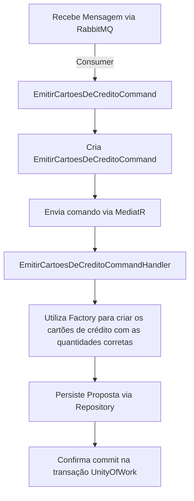

# PB.CartoesCredito

Microsserviço de emissão de cartões de crédito, a partir do score do cliente, ele não é responsável pelo limite isso é feito no PB.PropostaDeCredito, é o último serviço do fluxo de criação do cliente.

Este repositório implementa uma solução baseada em uma arquitetura em camadas utilizando os conceitos de DDD e CQRS, e integra componentes via REST API, Consumers, Factory, Repository, Services, Command Handlers, Mediator, Event Source, MassTransit e RabbitMQ.

## Visão Geral

O sistema é dividido em camadas:

- **API:** ([src/api/PB.CartoesCredito.Api](src/api/PB.CartoesCredito.Api))  
  Exposição de endpoints REST e integração com consumers (ex.: `CartoesCreditoConsumer`).
  
- **Application:** ([src/application/PB.CartoesCredito.Application](src/application/PB.CartoesCredito.Application))  
Responsável pelos command handlers, event handlers e a orquestração dos processos de negócio, utilizando MediatR para a comunicação entre componentes.
  
- **Domain:** ([src/domain/PB.CartoesCredito.Domain](src/domain/PB.CartoesCredito.Domain))  
Contém a lógica de negócio, entidades, fábricas (Factory) e eventos de domínio.
  
- **Infraestrutura:** ([src/infra/PB.CartoesCredito.Infra.Data](src/infra/PB.CartoesCredito.Infra.Data))  
Responsável pela persistência de dados e implementação dos repositórios e a implementação da UoW (UnityOfWork).
  
- **Testes:** ([test/PB.CartoesCredito.UnityTests](test/PB.CartoesCredito.UnityTests))  
  Contém testes unitários utilizando frameworks como xUnit.

## Estrutura do Projeto

```
[PB.CartoesCredito.sln]
├── .github/
├── dependencies/
│   ├── PB.Commons.Api.dll
│   └── PB.Commons.Infra.Kernel.dll
├── src/
│   ├── api/
│   │   └── PB.CartoesCredito.Api
│   │       ├── Controllers/
│   │       ├── Consumers/
│   │       └── ServicesExtensions.cs
│   ├── application/
│   │   └── PB.CartoesCredito.Application
│   │       └── CommandHandlers/
│   │           └── Cartoes/
│   │               └── EmitirCartoesDeCreditoCommandHandler.cs
│   ├── domain/
│   │   └── PB.CartoesCredito.Domain
│   │       └── Cartoes/
│   │           ├── CartaoDeCredito.cs
│   │           └── Command/
│   │               └── EmitirCartoesDeCreditoCommand.cs
│   └── infra/
│       └── PB.CartoesCredito.Infra.Data
│           ├── Cartoes/
│           │   └── CartaoDeCreditoRepository.cs
│           └── Context/
│               ├── PBCartoesCreditoDBContext.cs
│               └── Mapping/
│                   └── CartaoDeCreditoMap.cs
└── test/
    └── PB.CartoesCredito.UnityTests/
```

## Padrões e Tecnologias Utilizados

- **DDD (Domain-Driven Design):** Separação clara entre as camadas de domínio, aplicação, API e infraestrutura, isolando a complexidade de negócio no domínio.

- **CQRS (Command Query Responsibility Segregation)**: Uso de comandos (ex.: `EmitirCartoesDeCreditoCommand`) para as operações de escrita, tratados pelos command handlers.

- **REST API:** Exposição dos endpoints para consumo externo, permitindo a integração entre sistemas.

- **Consumer e MassTransit:** Um consumer, como o `CartaoDeCreditoConsumer`, integra-se ao sistema via RabbitMQ utilizando MassTransit para envio e recepção de mensagens.

- **Factory:** Utilizada para criar instâncias de entidades com regras de negócio.

- **Repository:** Abstração do acesso a dados, utilizando interfaces como `CartaoDeCreditoRepository`.

- **Services e Command Handler:** Responsáveis por orquestrar a lógica de negócio e a comunicação entre os componentes, utilizando MediatR para gerenciamento de mensagens.

- **Event Sourcing e Eventos de Domínio**: Preparado para disparar eventos, de domínio, para propagar alterações e acionar lógica adicional.

## Fluxo de Requisição

O fluxo principal de uma requisição para emitir os cartões de crédito:



Exemplo de criação de cartão de crédito via Factory:
```cs
public static class Factory
{
    public static List<CartaoDeCredito> Create(EmitirCartoesDeCreditoCommand command)
    {
        var cartoes = new List<CartaoDeCredito>();
        var quantidadesDeCartoesLiberados = ObterQuantidadeDeCartoesPorScore(command.Score);

        for (int i = 0; i < quantidadesDeCartoesLiberados; i++)
        {
            cartoes.Add(new CartaoDeCredito(
                Guid.NewGuid(),
                command.ClientId,
                command.Score,
                command.CreditoDisponivel
            ));
        }

        return cartoes;
    }

    private static int ObterQuantidadeDeCartoesPorScore(int score)
    {
        if (!ScorePermiteLiberacaoDeCartao(score))
        {
            return 0;
        }

        if (score <= 500)
        {
            return 1;
        }

        return 2;
    }

    private static bool ScorePermiteLiberacaoDeCartao(int score)
    {
        return score > 100;
    }
}
```

## Dependências

- **MassTransit:** Facilita a integração com RabbitMQ.
- **MediatR:** Gerencia a comunicação interna via comandos e eventos.
- **Entity Framework Core:** Utilizado para a persistência dos dados.
- **Bibliotecas Comuns:** DLLs presentes na pasta `dependencies`, como `PB.Commons.Api.dll` e `PB.Commons.Infra.Kernel.dll`.

## Como Executar

1. **Build do Projeto:**
    ```sh
    dotnet build PB.CartoesCredito.sln
    ```

2. **Iniciar a API:**
    ```sh
    dotnet run --project src/api/PB.CartoesCredito.Api/PB.CartoesCredito.Api.csproj
    ```

3. **Executar Testes:**

   No diretório raiz, execute:

   ```sh
   dotnet test test/PB.CartoesCredito.UnityTests/PB.CartoesCredito.UnityTests.csproj
   ```

### Exemplo de Command Handler
O processador de comandos encontra-se em `EmitirCartoesDeCreditoCommandHandler` (em `PB.CartoesCredito.Application/CommandHandlers/Cartoes/EmitirCartoesDeCreditoCommandHandler.cs`).

### Exemplo de Consumer
Veja a implementação em `CartaoDeCreditoConsumer` (em `PB.CartoesCredito.Api/Consumers/CartaoDeCreditoConsumer.cs`).

## Testes

Os testes unitários utilizam xUnit e FluentAssertions para validar o comportamento das regras de negócio, conforme exemplificado em:

- [test/PB.CartoesCredito.UnityTests/Domain](test/PB.CartoesCredito.UnityTests/Domain)  (testes de domínio)

Cada teste assegura a correta criação dos cartões.

## Resiliência e Configuração do Consumer

Para garantir a confiabilidade no processamento de mensagens, a aplicação utiliza mecanismos de resiliência configurados no MassTransit. Na configuração do consumer, foi implementado os seguintes pontos:

- **Immediate Retry:** São executadas tentativas imediatas (por exemplo, 5 tentativas) para tratar falhas transitórias sem necessidade de redelivery.

- **Delayed Redelivery:** Caso as tentativas imediatas falhem, é aplicado um redelivery escalonado, com intervalos predefinidos (por exemplo, 5s, 15s, 30s), aumentando a chance de sucesso sem sobrecarregar o sistema.

Exemplo de configuração no arquivo de serviços (ServicesExtensions.cs):

```cs
services.AddMassTransit(x =>
{
    cfg.ReceiveEndpoint("queue-name"), e =>
    {
        e.ConfigureConsumer<CartaoDeCreditoConsumer>(context);

        // caso todas as tentativas de reenvio imediato falhem, tenta reenviar a mensagem em 3 intervalos diferentes
        // com 5, 15 e 30 minutos de espera entre cada tentativa
        cfg.UseDelayedRedelivery(r => r.Intervals(TimeSpan.FromMinutes(5), TimeSpan.FromMinutes(15), TimeSpan.FromMinutes(30)));

        // caso de falha na entrega da mensagem, tenta reenviar 5 vezes imediatamente
        cfg.UseMessageRetry(r => r.Immediate(5));
    });
});
```

Com essa estratégia, o sistema tenta processar as mensagens imediatamente e, se necessário, realiza redelivery com intervalos definidos, aumentando a robustez e a confiabilidade da mensageria via RabbitMQ.

## Tratamento de Erros e Resiliência na Aplicação Disparadora

Na aplicação que dispara os comandos, a resiliência é tratada de forma robusta para garantir a integridade dos dados e a confiabilidade na comunicação com a fila de mensagens. Em caso de erro durante a inserção dos dados no banco, a API lança uma exception, impedindo o commit da transação. Isso garante que operações inválidas não sejam persistidas.

Além disso, antes de enviar a mensagem para a fila, a aplicação utiliza o comando `GetSendEndpoint(new Uri(...))` para obter o endpoint de envio. Caso a fila não exista, este comando automaticamente cria a fila, assegurando que a mensagem será encaminhada para o destino correto. Segue um exemplo ilustrativo:

```csharp
// Exemplo de obtenção do endpoint com criação automática da fila, se necessário
var endpoint = await bus.GetSendEndpoint(new Uri("queue:nome-da-fila"));

// Envio da mensagem
await endpoint.Send(mensagem);
```

## Tratamento de Erros e Resiliência na Aplicação Disparadora

Na aplicação que dispara os comandos, a resiliência é tratada de forma robusta para garantir a integridade dos dados e a confiabilidade na comunicação com a fila de mensagens. Em caso de erro durante a inserção dos dados no banco, a API lança uma exception, impedindo o commit da transação. Isso garante que operações inválidas não sejam persistidas.

Além disso, antes de enviar a mensagem para a fila, a aplicação utiliza o comando `GetSendEndpoint(new Uri(...))` para obter o endpoint de envio. Caso a fila não exista, este comando automaticamente cria a fila, assegurando que a mensagem será encaminhada para o destino correto. Segue um exemplo ilustrativo:

```csharp
// Exemplo de obtenção do endpoint com criação automática da fila, se necessário
var endpoint = await bus.GetSendEndpoint(new Uri("queue:nome-da-fila"));

// Envio da mensagem
await endpoint.Send(mensagem);
```